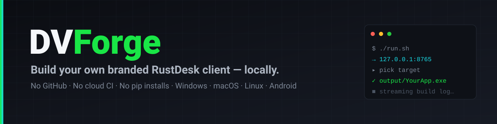
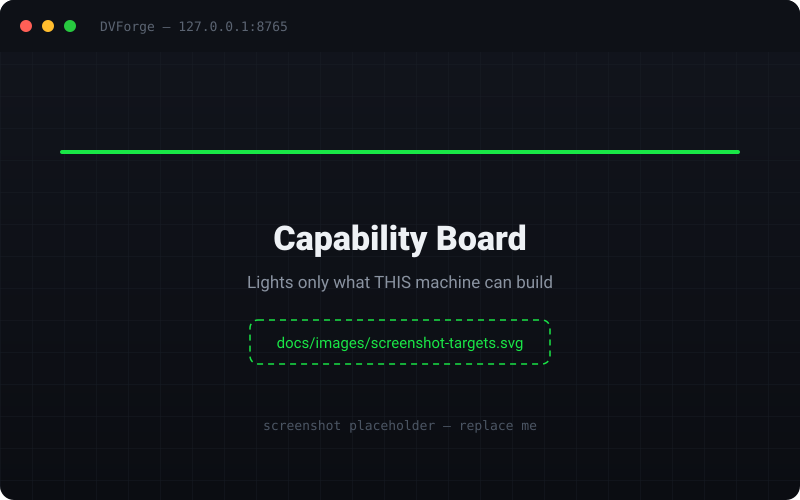
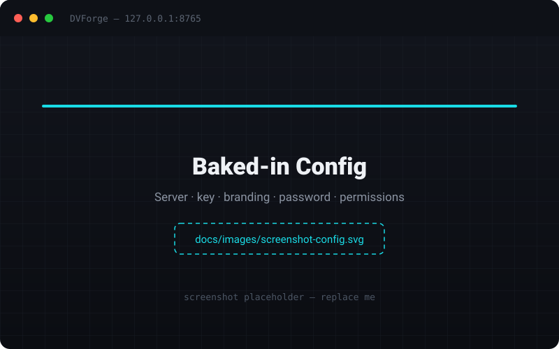
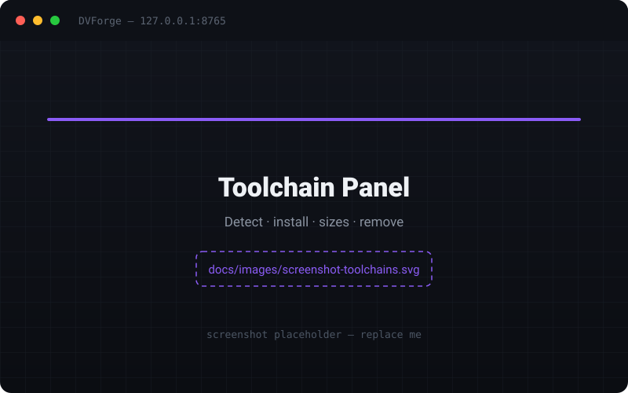
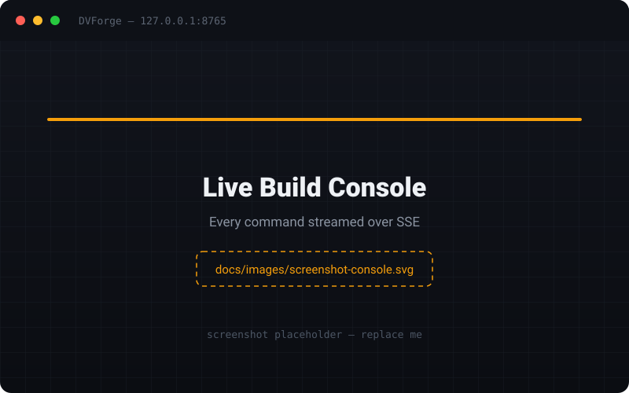
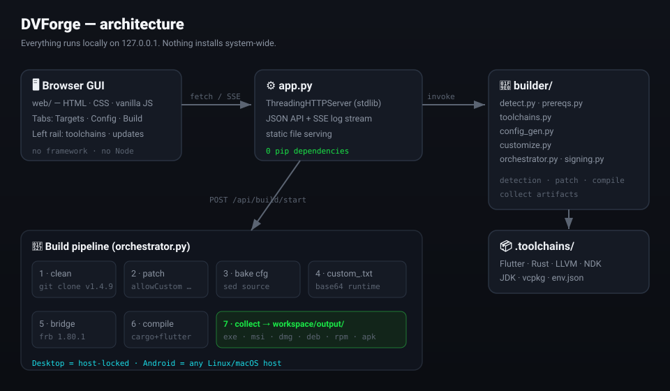

<!-- ══════════════════════════════════════════════════════════════════════ -->
<!--  DVForge — README                                                       -->
<!--  Replace docs/images/*.svg placeholders with real screenshots (see      -->
<!--  docs/images/README.md for the shot list).                              -->
<!-- ══════════════════════════════════════════════════════════════════════ -->

<div align="center">



# DVForge

### Build your own branded RustDesk client on **your** computer — server, key, password, and permissions baked in. **No GitHub. No cloud CI. No pip installs.**

<p>
Open a local page in the browser &nbsp;→&nbsp; pick a target &nbsp;→&nbsp; hit build.<br/>
The finished installer lands in <code>workspace/output/</code>.
</p>

<br/>

[](https://paypal.me/VenimK)
[](https://discord.gg/de2srV6sx)
[](#-quick-start-90-seconds)
[](#-who-can-build-what)
[](#)
[](LICENSE)
[](#-design-principles)

[](https://github.com/VenimK)
[](https://github.com/deadboy18)
[](https://github.com/Tiddley123)
[-A31F34?logo=github&logoColor=white)](https://github.com/bryangerlach)

</div>

---

## 📄 One-paragraph summary

**DVForge** is a tiny, zero-dependency (Python standard-library only) local web app that compiles a **customized [RustDesk](https://github.com/rustdesk/rustdesk) remote-desktop client** on your own machine. You point it at your self-hosted RustDesk server, set an app name, icon, baked-in password and permission set, pick a target platform, and it produces a ready-to-distribute installer — a Windows `.exe`/`.msi`, a macOS `.dmg`, Linux `.deb`/`.rpm`/`.AppImage`, or an Android `.apk`. It performs the exact same source customizations a GitHub Actions pipeline would, but everything runs offline on `127.0.0.1`, and the heavy build toolchains (Flutter, Rust, NDK, JDK, …) install into a private, project-local `.toolchains/` folder — **nothing touches your system**.

> **New here? Jump to → [Quick Start](#-quick-start-90-seconds) · [How it works](#-how-it-works) · [FAQ](#-faq) · [Troubleshooting](#-troubleshooting)**
>
> **AI agent / LLM reading this repo? Jump to → [🤖 For AI agents & automated tools](#-for-ai-agents--automated-tools) for a machine-oriented map of the whole codebase.**

---

## 📑 Table of contents

<details open>
<summary><b>Click to expand / collapse</b></summary>

- [Screenshots](#-screenshots)
- [Why DVForge?](#-why-dvforge)
- [Feature highlights](#-feature-highlights)
- [Quick start (90 seconds)](#-quick-start-90-seconds)
- [How it works](#-how-it-works)
  - [The three jobs](#the-three-jobs)
  - [The build pipeline](#the-build-pipeline)
  - [How customizations are applied](#how-customizations-are-applied-the-load-bearing-detail)
- [Detailed installation](#-detailed-installation)
  - [macOS](#macos)
  - [Windows (desktop .exe / .msi)](#windows-desktop-exe--msi)
  - [Windows + WSL2 (Linux packages + Android)](#windows--wsl2-linux-packages--android)
  - [Native Linux](#native-linux)
- [Running the app](#-running-the-app)
- [Using the GUI](#-using-the-gui)
- [Who can build what](#-who-can-build-what)
- [Android — which APK do I pick?](#-android--which-apk-do-i-pick)
- [Configuration reference](#-configuration-reference)
- [Toolchains reference](#-toolchains-reference)
- [Code signing](#-code-signing)
- [Output](#-output)
- [Build times (real-world)](#-build-times-real-world)
- [Multi-machine build farm](#-multi-machine-build-farm)
- [Printer adapter (remote printing)](#-printer-adapter-remote-printing)
- [Patches & tweaks reference](#-patches--tweaks-reference)
- [Project layout](#-project-layout)
- [API reference](#-api-reference)
- [Environment variables & flags](#-environment-variables--flags)
- [Troubleshooting](#-troubleshooting)
- [Uninstall & clean](#-uninstall--clean)
- [FAQ](#-faq)
- [Design principles](#-design-principles)
- [For AI agents & automated tools](#-for-ai-agents--automated-tools)
- [Contributing](#-contributing)
- [Credits & license](#-credits--license)
- [Community](#-community)

</details>

---

## 📸 Screenshots

> _Placeholders below — replace the files in `docs/images/` with real captures. See [`docs/images/README.md`](docs/images/README.md) for the exact shot list._

<div align="center">

| Capability board | Baked-in config |
|:---:|:---:|
|  |  |
| **The board lights only what _this_ machine can build.** | **Everything that gets baked into the client.** |

| Toolchain panel | Live build console |
|:---:|:---:|
|  |  |
| **Detect, one-click install, on-disk sizes, remove.** | **Every command streamed live over SSE.** |

</div>

---

## 🎯 Why DVForge?

RustDesk is fantastic, but distributing a client that already knows *your* server — with your branding, your baked-in password, and your permission policy — normally means running a CI pipeline on GitHub Actions. That's slow, public-ish, requires secrets in the cloud, and is a pain to iterate on.

**DVForge removes GitHub from the loop entirely:**

| The old way (cloud CI) | The DVForge way (local) |
|---|---|
| Push to GitHub, wait for Actions | Click **Build**, watch the log stream live |
| Secrets live in the cloud | Everything stays on `127.0.0.1` |
| One workflow file per platform | One folder, one UI, every platform |
| System-wide SDK installs | Portable `.toolchains/` — nothing system-wide |
| `pip install` a wall of deps | **Zero** pip dependencies (stdlib only) |
| Opaque runner logs | Full command visibility + **dry-run preview** |

It's built for **people who self-host RustDesk** and want a client that already knows their server — MSPs, IT departments, homelab users, and anyone shipping branded remote-support tools.

---

## ✨ Feature highlights

- 🖥️ **Browser GUI, zero install** — a Python stdlib HTTP server serves a local page at `http://127.0.0.1:8765`. No Electron, no Node, no framework.
- 🧠 **Capability-aware board** — auto-detects your OS/CPU and lights *only* the targets this machine can actually produce. Wrong-OS targets are visibly disabled, not silently failing.
- 📦 **Portable toolchains** — Flutter, Rust, LLVM, NDK, JDK, vcpkg, and more download into a project-local `.toolchains/` folder. One click each, or "install missing." Delete the folder to reset.
- 🎨 **Full branding** — app name, company name, icon, logo, accent colors, light/dark theme, slogan, download/URL links — all baked in.
- 🔐 **Baked-in security policy** — server address, public key, API server, a permanent password, approve mode, and a per-feature permission matrix (keyboard, clipboard, file transfer, audio, recording, terminal, printer, camera, …).
- 🔁 **Connection direction lock** — ship an *incoming-only* host, an *outgoing-only* controller, or a full `both` client.
- 🧩 **Feature patches** — hide the connection manager, remove the update nag, strip the "set up your server" tip, hide offline peers, add a privacy screen, and more (toggle in the GUI).
- 📱 **Android from Linux/macOS** — cross-compile every ABI (`arm64-v8a`, `armeabi-v7a`, `x86_64`, or a universal APK).
- ✍️ **Code signing** — Windows Authenticode (PFX + timestamp), Android keystore, macOS Developer ID / notarization / self-signed `.p12`. Or generate a self-signed cert from the UI for local tests.
- 🕵️ **Dry-run / Preview plan** — print every command that *would* run, without compiling. See the whole plan first.
- 📡 **Live streaming logs** — build output streams to the browser over Server-Sent Events; refresh-safe (logs replay).
- 🌐 **Optional build farm** — offload each OS's build to a machine that can actually do it (a Mac builds DMGs, a Windows box builds EXEs), over a shared folder *or* a small HTTP queue.
- 🖨️ **Open printer adapter** — an included Rust crate that restores remote printing in custom builds (RustDesk's stock printer DLL refuses to run for non-RustDesk-signed executables).
- 🧹 **Clean uninstall** — dedicated uninstall/clean scripts per OS; your config and branding are preserved by default.

---

## 🚀 Quick start (90 seconds)

### 1 · Get the app

```bash
git clone https://github.com/VenimK/DVForge.git
cd DVForge
```

### 2 · First-time machine setup — pick your OS

| You are on | Run this |
|---|---|
| 🍎 **macOS** (DMG; add Android with `--with-android`) | `bash Setup-DVForge-macOS.sh` |
| 🪟 **Windows** (`.exe` / `.msi`) | `powershell -NoProfile -ExecutionPolicy Bypass -File .\Setup-DVForge-Windows.ps1` |
| 🐧 **Windows + WSL2** (Linux packages + Android APKs) | `powershell -NoProfile -ExecutionPolicy Bypass -File .\Setup-DVForge-WSL2.ps1` |

> Already inside the cloned folder and don't want it copied elsewhere?
> macOS: `bash Setup-DVForge-macOS.sh --in-place` · Windows: add `-InPlace`.
>
> You can run **both** the Windows and WSL2 installers on one PC — Windows for `.exe`/`.msi`, WSL for Android + Linux packages.

### 3 · Launch

```bash
# Linux / macOS
./run.sh

# Windows
run.bat
```

…or just `python3 app.py`. The UI opens automatically at **[http://127.0.0.1:8765](http://127.0.0.1:8765)**.

### 4 · Build

1. **Targets tab** → click a lit target (e.g. *Windows x86_64 (exe)*).
2. **Config tab** → set your server, key, app name, password, permissions.
3. **Build tab** → hit **Preview plan** once to see the commands, then **Build**. Watch it stream.

Your installer appears in **`workspace/output/v1.4.9/`**. Done. 🎉

---

## 🛠️ How it works

<div align="center">

</div>

DVForge is three cooperating layers:

1. **`web/`** — a hand-written browser GUI (HTML + CSS + vanilla JS, no framework) with a hardware-capability aesthetic. Three tabs: **Targets**, **Config**, **Build**, plus a left rail for toolchains and updates.
2. **`app.py`** — a `ThreadingHTTPServer` built entirely on the Python standard library. It serves the static GUI, exposes a small JSON API, and fans out live build/install logs over **Server-Sent Events (SSE)**. No Flask, no FastAPI, no pip.
3. **`builder/`** — the engine. Detection, toolchain management, config generation, source customization, and build orchestration (see [Project layout](#-project-layout) for the module map).

### The three jobs

```
┌───────────────┐     ┌──────────────┐     ┌────────────────────┐
│  1. DETECT    │ ──▶ │  2. CONFIG   │ ──▶ │  3. BUILD          │
│  hardware &   │     │  edit server │     │  checkout source,  │
│  OS → which   │     │  key, brand, │     │  patch it, compile │
│  targets are  │     │  password,   │     │  per-OS, collect   │
│  buildable    │     │  permissions │     │  artifacts, stream │
└───────────────┘     └──────────────┘     └────────────────────┘
   detect.py            config_gen.py           orchestrator.py
   prereqs.py                                    customize.py
```

### The build pipeline

When you hit **Build**, `orchestrator.py` runs (roughly) this sequence:

```
1. Clean checkout    →  git clone RustDesk @ tag v1.4.9 into workspace/rustdesk-src
                        (any previous tree is removed first — customizations mutate it)
2. Apply patches     →  allowCustom (strip signature check), hidecm, xoffline,
                        removeNewVersionNotif, removeSetupServerTip, privacyScreen, …
3. Bake config       →  sed/patch server, key, API, app/company name, URLs, flags
                        into the RustDesk *source* (compiled-in customizations)
4. Emit custom_.txt  →  base64-encoded password + permissions (runtime config)
                        (Android: also embedded into MainService.kt + native_model.dart)
5. Bridge codegen    →  flutter_rust_bridge_codegen (local, 1.80.1)
6. Compile           →  cargo + flutter build (per target: exe/msi/dmg/deb/rpm/apk)
7. Collect           →  copy finished installers to workspace/output/v<version>/
```

**Dry-run / Preview plan** prints every command in this sequence **without executing** the compile — run it once to understand exactly what will happen on your machine.

### How customizations are applied (the load-bearing detail)

Customizations land **two different ways**, and mixing them up is the classic footgun:

| Kind | What | When it's read | How |
|---|---|---|---|
| **Compiled-in** | Server IP, public key, API server, app/company name, URLs, feature flags | At build time | `sed`-patched into the RustDesk **source** before compiling |
| **Runtime** | Password, permissions, approve mode | At client startup | Read from a **base64** `custom_.txt` file next to the binary |

> ⚠️ **`custom_.txt` MUST be base64, not raw JSON.** RustDesk's `read_custom_client()` begins with `decode64()`. `config_gen.py` emits the correct base64 payload (verified byte-for-byte against the original `load-config.py`).
>
> 📱 **Android never file-reads `custom_.txt`.** On Android the base64 config is embedded directly into native code (`MainService.kt`, `native_model.dart`) *and* bundled as a Flutter asset. `customize.py` handles this automatically.
>
> 🔓 **The signature check.** `allowCustom.py` strips a 9-line signature-verification block from `src/common.rs` and renames `custom.txt` → `custom_.txt`, so your unsigned/custom build will actually load its baked-in config.

---

## 📥 Detailed installation

All setup scripts are **idempotent** (safe to re-run) and write a portable `.toolchains/env.json` so installed tools are picked up automatically on the next launch. Python 3.8+ is the only prerequisite you must have beforehand.

### macOS

```bash
bash Setup-DVForge-macOS.sh                 # DMG toolchain
bash Setup-DVForge-macOS.sh --with-android  # + JDK 17, NDK r28c, Android SDK (API 34) for APKs
bash Setup-DVForge-macOS.sh --in-place      # use this folder, don't copy to ~/DVForge
bash Setup-DVForge-macOS.sh --skip-optional # skip sccache / ImageMagick / potrace
```

Installs / verifies: Xcode Command Line Tools (git, clang, `iconutil`), Homebrew, Python 3.8+, cmake, ninja, nasm, pkg-config, `create-dmg`, cocoapods, then via `builder/toolchains.py`: **Rust 1.81** (macOS pin), **Flutter 3.24.5**, **LLVM/libclang 15.0.6**, **vcpkg** (pinned), **sccache 0.11.0**, ImageMagick, potrace. It pins `rustup` to `1.81-<host>` and adds both Darwin targets so universal DMGs can `lipo`. Writes `.toolchains/env.json` + a DVForge block in `~/.zprofile`.

### Windows (desktop `.exe` / `.msi`)

```powershell
# Default install → C:\DVForge (short path = reliable deep-path builds)
powershell -NoProfile -ExecutionPolicy Bypass -File .\Setup-DVForge-Windows.ps1

# Use the folder you already have open
powershell -NoProfile -ExecutionPolicy Bypass -File .\Setup-DVForge-Windows.ps1 -InPlace

# Skip the large (~4–6 GB) Visual Studio Build Tools install
powershell -NoProfile -ExecutionPolicy Bypass -File .\Setup-DVForge-Windows.ps1 -SkipVsBuildTools
```

Installs / verifies: Git, Python 3 (via winget if missing), `LongPathsEnabled` (so Flutter/MSBuild deep paths don't break), then: **Rust 1.75 (MSVC)**, **Flutter 3.24.5**, **LLVM/libclang 15**, **vcpkg** (pinned), **VS Build Tools 2022** (the C++ workload — `link.exe` + MSBuild), **.NET 8 SDK**, **NuGet**, **sccache 0.11.0**, **ImageMagick** (official installer → `.toolchains\imagemagick`), and optionally **JDK 17**. Pins `rustup` to `1.75-x86_64-pc-windows-msvc`.

> 🧱 **The MSVC linker is mandatory on Windows — for _every_ target, including Android.** Rust's Windows host toolchain is MSVC, and *any* `cargo` compile needs `link.exe`. Until VS Build Tools (C++) are installed, board cells read **"install first: msbuild."** This one ~4–6 GB, admin-requiring piece is the only unavoidably heavy install; it's excluded from bulk "install missing" and requires an explicit click.

### Windows + WSL2 (Linux packages + Android)

```powershell
powershell -NoProfile -ExecutionPolicy Bypass -File .\Setup-DVForge-WSL2.ps1
```

Sets up WSL + Debian, then installs Flutter / Android SDK+NDK / vcpkg / Rust / JDK / LLVM **inside the Linux distro** (`~/DVForge`), producing Android APKs + `.deb`/`.rpm`/`.AppImage`. Run this **alongside** the Windows script on the same PC to cover every target.

### Native Linux

Clone the repo, ensure Python 3.8+, then `./run.sh` and use the toolchain panel's **install missing** to fetch Flutter, Rust, LLVM, NDK, JDK, and vcpkg into `.toolchains/`. Produces `.deb`, `.rpm`, `.AppImage`, and Android APKs.

---

## ▶️ Running the app

```bash
./run.sh              # Linux / macOS
run.bat               # Windows
python3 app.py        # any OS, direct
```

Flags & environment:

| Option | Effect |
|---|---|
| `--no-browser` | Don't auto-open the browser (useful for headless / farm workers) |
| `RDLB_PORT=9000` | Change the listen port (default `8765`) |

The server binds to `127.0.0.1` only — it is **not** exposed to your network by default. (See [Build farm](#-multi-machine-build-farm) for the safe way to accept remote jobs.)

---

## 🖱️ Using the GUI

**Left rail — This machine + Toolchains.** Shows your detected CPU/OS spec, plus every toolchain with its state, download/on-disk size, version, a per-tool **remove (✕)**, and a total local footprint. **Install missing** grabs everything installable in one go (except VS Build Tools, which needs an explicit click). **Check for updates** pulls a newer DVForge commit when you want it.

**Targets tab — "What can this machine build?"** A board of every RustDesk target. Cell states:

| State | Meaning |
|---|---|
| 🟠 **Amber / ready** | This machine can build it right now — click to select |
| ⬜ **Outline** | Needs a tool — the cell says *install first: `<tool>`* |
| ▨ **Hatched / disabled** | Wrong OS (e.g. DMG on Windows) — can't build here |

**Config tab — "Baked-in config."** Server / key / API, branding (name, icon, logo, accent, theme, slogan), password & approve mode, the full permission matrix, connection direction, and all the [feature tweaks](#-patches--tweaks-reference). A **live preview** shows the exact baked-in payload as you type.

**Build tab — "Build."** Select target(s), optionally **Preview plan** (dry-run), then **Build**. The console streams every command; **Cancel** stops a run. On success, artifacts are listed with an **open folder** button.

---

## 🧩 Who can build what

Desktop clients are **host-locked** — each is built on its own OS (this mirrors the original CI workflows and is not a limitation DVForge can lift). **Android is cross-platform** and builds on any Linux or macOS host.

| You want | Build it on | You get | Target ID |
|---|---|---|---|
| 🪟 Windows app | Windows | portable `.exe`, optional `.msi` | `windows-x86_64-exe`, `windows-x86_64-msi` |
| 🍎 macOS Apple Silicon | any Mac | `*-aarch64.dmg` | `macos-arm64-dmg` |
| 🍎 macOS Intel | any Mac | `*-x86_64.dmg` (cross-compiled from Apple Silicon) | `macos-x86_64-dmg` |
| 🍎 macOS universal | any Mac | `*-universal.dmg` (both CPUs, slower) | `macos-universal-dmg` |
| 🐧 Linux (x86_64) | Linux / WSL | `.deb` / `.rpm` / `.AppImage` | `linux-x86_64-deb`, `linux-x86_64-rpm`, `linux-x86_64-appimage` |
| 🐧 Linux (ARM64) | Linux / WSL | `.deb` | `linux-aarch64-deb` |
| 📱 Android phone / tablet | Linux, WSL, or macOS | `.apk` | `android-arm64`, `android-armv7`, `android-x86_64`, `android-universal` |

> 🚫 **Windows PCs cannot build APKs** (the Android `.sh` scripts need a Unix host; on Windows use WSL2). The board hides impossible combinations for you.

---

## 📱 Android — which APK do I pick?

Pick the cell that matches the **device CPU**, not the computer you built on.

| Device | Board cell | File name |
|---|---|---|
| Almost every phone (Galaxy A54 5G, Pixel, most 2019+) | **Android arm64-v8a** | `YourApp-arm64-v8a-release.apk` |
| Very old 32-bit phones | Android armeabi-v7a | `…-armeabi-v7a-release.apk` |
| Android x86 emulators / some tablets | Android x86_64 | `…-x86_64-release.apk` |
| One APK for every ABI (largest) | Android universal | `…-release.apk` |

- Only the target you selected is collected into `output/`.
- 🛡️ Sideloaded remote-desktop APKs **always** trip Play Protect ("install anyway"). That's expected — it is not a broken build.
- ✍️ APKs use **debug signing** unless you add your own keystore (see [Code signing](#-code-signing)).

**Get the Android toolchain** (Linux or Mac): click **install** on the board, or on macOS run `bash Setup-DVForge-macOS.sh --with-android`. That installs **JDK 17**, **NDK r28c** (16 KB page size — required on Android 15+), and the **Android SDK (API 34)** into `.toolchains/`, reusing the same Flutter you already have for DMGs.

---

## ⚙️ Configuration reference

Everything lives in **`configs/RustDesk.json`** — edit it in the GUI (recommended) or by hand. Below is the full field reference.

<details open>
<summary><b>Core / server</b></summary>

| Field | Example | Meaning |
|---|---|---|
| `version` | `1.4.9` | RustDesk source tag to build |
| `platform` | `windows` | Target platform hint |
| `serverIP` | `your.server.com` | Rendezvous/relay server — **compiled in** |
| `key` | `YourApiKeyHere` | Server public key — **compiled in** |
| `apiServer` | `https://api.you.com/` | API server URL — **compiled in** |
| `appname` / `exename` / `compname` | `loadworker` | App name, executable name, company name |
| `androidappid` | `com.e4bdb2cd.client` | Android application ID |
| `urlLink` / `downloadLink` | `https://you.com` | Branding links baked into the client |
| `slogan` | `loadworker` | Client slogan |
| `direction` | `both` | `both` · `incoming` (host-only) · `outgoing` (controller-only) |

</details>

<details>
<summary><b>Branding & theme</b></summary>

| Field | Example | Meaning |
|---|---|---|
| `iconFile` / `logoFile` | `workspace/branding/icon.png` | Paths to icon/logo used at build |
| `iconbase64` / `logobase64` | `<base64>` | Embedded icon/logo bytes (so farm workers can recreate them) |
| `theme` | `light` | Default theme (`light` / `dark`) |
| `themeDorO` | `override` | Theme **d**efault-**or**-**o**verride |
| `themeColor` | `#19E646` | Primary accent |
| `themeSurfaceLight` / `themeSurfaceDark` | `#19DBE6` / `#18191E` | Surface colors |
| `themeMeColor` | `#21790B` | "Me" accent |

</details>

<details>
<summary><b>Password & permissions</b></summary>

| Field | Example | Meaning |
|---|---|---|
| `passApproveMode` | `password` | Approve mode |
| `permanentPassword` | `CHANGE_ME` | Baked-in permanent password (**runtime**, via base64 `custom_.txt`) |
| `permissionsDorO` | `default` | Permissions default-or-override |
| `permissionsType` | `custom` | Permission preset type |
| `enableKeyboard`, `enableClipboard`, `enableFileTransfer`, `enableAudio`, `enableTCP`, `enableRemoteRestart`, `enableRecording`, `enableBlockingInput`, `enableRemoteModi`, `enablePrinter`, `enableCamera`, `enableTerminal` | `on` / off | Per-feature permission toggles |
| `overrideManual` | `hide-tray=Y\n…` | Extra RustDesk config lines appended verbatim |
| `defaultManual` | `` | Default config lines |

</details>

<details>
<summary><b>Tweaks (feature patches)</b></summary>

| Field | Meaning |
|---|---|
| `hidecm` | Hide the connection manager window |
| `removeNewVersionNotif` | Remove the "new version available" nag |
| `removeWallpaper` | Remove wallpaper during sessions |
| `denyLan` | Deny LAN discovery |
| `enableDirectIP` | Allow direct IP access |
| `autoClose` | Auto-close behavior |
| `cycleMonitor` | Cycle monitors |
| `xOffline` | Show/hide offline peers styling |
| `statussort` | Sort peers by status |
| `delayFix` | Input-delay fix |

</details>

<details>
<summary><b>Signing (see the dedicated section)</b></summary>

| Field | Meaning |
|---|---|
| `signWinPfx` / `signWinPassword` / `signWinTimestamp` | Windows Authenticode PFX, its password, RFC-3161 timestamp URL |
| `signAndroidKeystore` / `signAndroidAlias` / `signAndroidStorePassword` / `signAndroidKeyPassword` | Android keystore + credentials |
| `signMacIdentity` | macOS Developer ID / Keychain identity |
| `signMacP12` / `signMacP12Password` | macOS signing `.p12` + password |
| `signMacNotaryKey` / `signMacNotaryKeyId` / `signMacNotaryIssuer` | Apple notarization API key details |

</details>

---

## 🧰 Toolchains reference

The left rail **detects** what you have and can **download a portable copy** of most tools into `.toolchains/` (no admin). Click **install** next to a gap, or **install missing**.

| Tool | Version (pin) | Needed for |
|---|---|---|
| **Python** | 3.8+ | the app itself (must pre-exist) |
| **Git** | any | source checkout |
| **Rust** | 1.75 · (1.81 on macOS) | every native build |
| **Flutter** | 3.24.5 | every Flutter UI |
| **flutter_rust_bridge_codegen** | 1.80.1 | Dart⇄Rust bridge codegen |
| **LLVM / libclang** | 15.0.6 | bindgen / ffigen |
| **vcpkg** | pinned `120deac3…ba10b` | FFmpeg / hwcodec |
| **JDK** | 17 | Android |
| **Android NDK** | r28c | Android native lib (16 KB pages, Android 15+) |
| **Android SDK** | API 34 | `flutter build apk` |
| **VS Build Tools (C++)** | 2022 | Windows linker (`link.exe`) + MSBuild — **required for all Windows-host builds** |
| **.NET 8 SDK / NuGet** | 8 | Windows `.msi` packaging |
| **sccache** | 0.11.0 | compile caching (optional) |
| **ImageMagick / potrace** | — | icon/logo processing (optional) |
| **Xcode + create-dmg** | — | macOS `.dmg` |

> Xcode and Visual Studio **cannot** be silently sideloaded — the UI gives the exact install hint for those. Everything else installs one-click.
>
> **Reset:** delete `.toolchains/` to start tool downloads clean, then use the [uninstall scripts](#-uninstall--clean).

---

## 🔐 Code signing

DVForge can produce **signed** installers, or generate self-signed material from the UI for local tests.

| Platform | Options | UI action |
|---|---|---|
| 🪟 **Windows** | Authenticode PFX + RFC-3161 timestamp | `POST /api/signing/self-signed` generates a self-signed code-signing PFX (and trusts it locally) for testing |
| 🤖 **Android** | Your keystore + alias + passwords | `POST /api/signing/android-keystore` generates a debug/keystore for testing; otherwise APKs use **debug signing** |
| 🍎 **macOS** | Developer ID / Keychain identity, or `.p12`, plus Apple **notarization** (API key) | `POST /api/signing/macos-self-signed` generates a self-signed identity for local runs |

> Signing files (`signWinPfx`, `signMacP12`, keystores) are embedded as base64 in the saved config so a **farm worker** can recreate `workspace/signing/` remotely. Apple **Developer ID / Keychain** identities are *not* files — they must already exist on the Mac worker.

---

## 📤 Output

Finished installers are collected here, versioned by the RustDesk tag:

```
workspace/output/v1.4.9/
├── YourApp-1.4.9-aarch64.dmg
├── YourApp-1.4.9.exe
├── YourApp-1.4.9.msi
├── YourApp-1.4.9.deb
├── YourApp-1.4.9.rpm
├── YourApp-arm64-v8a-release.apk
└── …
```

---

## ⏱️ Build times (real-world)

Measured on real hardware (WSL2 Debian) — your mileage varies with CPU, disk, and cache state. First runs are slowest (cold toolchain + full source compile); subsequent runs benefit from `sccache`.

| Target | Time | Notes |
|---|---|---|
| Linux `.rpm` | ~8m 29s | |
| Linux `.deb` | ~8m 13s | |
| Linux `.deb` (ARM) | ~7m 52s | |
| Android arm64-v8a | ~14m 56s | |
| Android x86_64 | ~14m 43s | |
| Android armeabi-v7a | ~18m 36s | |
| Android universal (all ABIs) | ~64 min | first run; normal for all-ABI |

---

## 🌐 Multi-machine build farm

> Optional. Lets you offload each OS's build to a machine that can actually do it — a Mac builds DMGs, a Windows box builds EXEs, a Linux box builds APKs + packages. DVForge itself **still stays on `127.0.0.1`** on every machine; only a small job queue is shared.

**Model:** you drop a job → a worker that matches the job's OS claims it → the finished file lands in an outbox.

```
You submit a job   →   farm/inbox/*.json   (or the HTTP queue)
   Mac worker      →   claims macos-*  →  builds .dmg
   Windows worker  →   claims windows-* → builds .exe / .msi
   Linux worker    →   claims linux-* + android-* → builds packages / APKs
Finished files     →   farm/outbox/<job-id>/   (+ status.json)
Failures           →   farm/failed/
```

Two transports are supported:

1. **Shared folder** (NAS/SMB/NFS) — every worker watches the same `farm/` directory. Start `python3 farm/worker.py` on each machine; submit with `python3 farm/submit.py --targets macos-arm64-dmg`.
2. **HTTP queue** — run `farm/queue.py` behind nginx (HTTPS + bearer token) and let workers claim over HTTP with `python worker.py --queue "https://api.example" --token "…"`. There's a public submit UI (`farm/public/`) and live stats at `/status`, `/health`, `/stats`.

**Worker rating:** new machines start at 50%. Higher-rated idle workers of the same OS get jobs first. A worker with zero successes after 2+ jobs, or 5 failures in a row, is skipped until reset. You can **pin** a specific machine for a job.

> 🔒 **Security:** never expose port 8766 or DVForge's `:8765` to the public internet without nginx HTTPS + a token. Prefer blocking `/api/build/` on any public vhost and letting the queue be the only public entry. **One job = one OS.**

Full walk-through (both PCs, NAS mounts, nginx, curl recipes, worker reset/pin): **[`farm/README.md`](farm/README.md)**.

---

## 🖨️ Printer adapter (remote printing)

RustDesk's stock `printer_driver_adapter.dll` verifies the **calling executable's Authenticode signature** inside `init()` and refuses to run for anything not signed by RustDesk — so remote printing silently fails in custom builds:

```
ERROR [src\server.rs:160] printer service init failed: Failed to init printer driver
```

Signing with *your own* cert doesn't help — the check is an allow-list of specific RustDesk identities, not "is it signed." Everything else in RustDesk's printing chain is open source.

**`printer-adapter/`** is a drop-in Rust replacement that reimplements the exact same four-function C ABI (`init` / `uninit` / `get_prn_data` / `free_prn_data`) with **no signature check**. It captures print jobs via a virtual printer whose Local Port name *is a file path*, polls that spool directory, and returns the bytes — no custom print driver, therefore no WHQL signing required.

Full explanation, ABI, and capture mechanics: **[`printer-adapter/README.md`](printer-adapter/README.md)**.

---

## 🩹 Patches & tweaks reference

DVForge applies patches to the RustDesk (and sometimes Flutter) source at build time. The essential ones run always; the rest are GUI toggles.

| Patch / file | Effect |
|---|---|
| `patches/allowCustom.py` · `allowCustom.diff` | **Required.** Strips the 9-line signature-check block from `src/common.rs`; renames `custom.txt` → `custom_.txt` so baked-in config loads |
| `patches/hidecm.diff` | Hide the connection manager (CM) window |
| `patches/removeNewVersionNotif.diff` | Remove the "new version available" notification |
| `patches/removeSetupServerTip.diff` | Remove the "set up your server" tip on the connection page |
| `patches/xoffline.diff` | Change offline-peer display in the peer card |
| `patches/privacyScreen.py` | Add privacy-screen support (PNG→C++ image embed) |
| `patches/flutter_3.24.4_dropdown_menu_enableFilter.diff` | Enable filtering in Flutter's dropdown menu |
| `patches/load-config-original.py` | Reference: the original CI `load-config.py` DVForge stays byte-compatible with |

---

## 🗂️ Project layout

```
DVForge/
├── app.py                       # Local HTTP UI + JSON API + SSE log stream (stdlib only)
├── run.sh / run.bat             # Launchers (Linux/macOS · Windows)
├── precheck.sh / precheck.bat   # Pre-flight environment check
│
├── Setup-DVForge-macOS.sh       # First-time toolchain setup, per OS
├── Setup-DVForge-Windows.ps1
├── Setup-DVForge-WSL2.ps1
├── Uninstall-DVForge-*.{sh,ps1} # Matching uninstallers
├── clean.sh / clean.bat         # Clean-slate reset (keeps config + branding)
│
├── builder/                     # ── the engine ──
│   ├── detect.py                #   hardware/OS detection + capability matrix
│   ├── prereqs.py               #   toolchain detection + per-OS install hints
│   ├── toolchains.py            #   portable toolchain download/install + env.json
│   ├── config_gen.py            #   RustDesk.json → CUSTOM_* + base64 custom_.txt
│   ├── customize.py             #   all sed/patch steps, Android embed, signature strip
│   ├── orchestrator.py          #   build orchestration (checkout→patch→compile→collect)
│   ├── signing.py               #   Windows/macOS/Android self-signed material
│   └── precheck.py              #   environment pre-flight
│
├── web/                         # ── the browser GUI ──
│   ├── index.html               #   spec readout, capability board, config form, console
│   ├── app.js                   #   all client logic (vanilla JS)
│   ├── advanced-keys.js         #   advanced config keys
│   └── style.css                #   hardware-capability aesthetic
│
├── configs/
│   └── RustDesk.json            # Your baked-in config (edit in the GUI)
│
├── patches/                     # allowCustom + feature diffs (see reference above)
│
├── farm/                        # ── optional multi-machine build farm ──
│   ├── worker.py                #   claims + builds jobs matching its OS
│   ├── queue.py                 #   HTTP job queue (run behind nginx + token)
│   ├── submit.py                #   submit a job
│   ├── inbox/ outbox/ failed/ … #   job flow directories
│   ├── public/                  #   public submit UI (index/join/stats)
│   └── README.md                #   full farm guide
│
├── printer-adapter/             # ── open printer_driver_adapter.dll replacement ──
│   ├── src/lib.rs               #   the four-function C ABI, no signature check
│   ├── Cargo.toml
│   └── README.md
│
├── workspace/                   # (created at runtime)
│   ├── rustdesk-src/            #   cloned + customized RustDesk source
│   ├── branding/                #   your icons/logos
│   ├── signing/                 #   generated signing material
│   └── output/v<version>/       #   ✅ finished installers
│
├── .toolchains/                 # (created on install) portable SDKs + env.json
│
├── HANDOFF.md                   # Deep engineering context / test history
├── LICENSE                      # GPL-3.0
└── README.md                    # You are here
```

---

## 🔌 API reference

`app.py` exposes a small JSON + SSE API on `http://127.0.0.1:8765`. Useful for scripting or for understanding the GUI's behavior.

<details open>
<summary><b>GET endpoints</b></summary>

| Endpoint | Returns |
|---|---|
| `GET /api/host` | Detected hardware + OS spec |
| `GET /api/prereqs` | Toolchain detection results |
| `GET /api/matrix` | Capability matrix (which targets are buildable) |
| `GET /api/config` | Current `RustDesk.json` |
| `GET /api/config/status` | Config validity / status |
| `GET /api/build/stream` | **SSE** — live build log |
| `GET /api/build/status` | Current build state / result |
| `GET /api/toolchains` | Toolchain list with sizes/versions |
| `GET /api/toolchains/stream` | **SSE** — live install log |
| `GET /api/toolchains/status` | Install state |
| `GET /api/update/status` | Update availability |
| `GET /api/update/stream` | **SSE** — live update log |
| `GET /api/branding/<file>` | Serve a branding asset (icon/logo) |

</details>

<details>
<summary><b>POST endpoints</b></summary>

| Endpoint | Does |
|---|---|
| `POST /api/config` | Save config (unpacks embedded icon/logo/signing blobs) |
| `POST /api/preview` | Render the baked-in `custom_.txt` preview |
| `POST /api/build/preflight` | Validate before building |
| `POST /api/build/start` | Start a build (`dry_run` supported) |
| `POST /api/build/cancel` | Cancel the running build |
| `POST /api/toolchains/install` | Install a toolchain / "install missing" |
| `POST /api/toolchains/cancel` | Cancel a running install |
| `POST /api/toolchains/remove` | Remove a locally-installed toolchain |
| `POST /api/signing/self-signed` | Generate a Windows self-signed PFX |
| `POST /api/signing/android-keystore` | Generate an Android keystore |
| `POST /api/signing/macos-self-signed` | Generate a macOS self-signed identity |
| `POST /api/upload` | Upload a branding/signing file |
| `POST /api/open-folder` | Open the output folder in the OS file manager |
| `POST /api/update/start` | Pull a newer DVForge commit |

</details>

---

## 🎚️ Environment variables & flags

| Variable / flag | Where | Effect |
|---|---|---|
| `RDLB_PORT` | `app.py` | Listen port (default `8765`) |
| `--no-browser` | `app.py` / launchers | Don't auto-open the browser |
| `DVFORGE_URL` | farm worker | DVForge instance the worker drives (default `http://127.0.0.1:8765`) |
| `DVFORGE_FARM` | farm worker | Path to the shared `farm/` directory |
| `DVFORGE_FARM_TOKEN` | `farm/queue.py` | Bearer token for the HTTP queue |

---

## 🩺 Troubleshooting

Hard-won fixes from real Windows/macOS/Linux test rounds (see `HANDOFF.md` for the full history):

| Symptom | Cause & fix |
|---|---|
| `linker link.exe not found` (Windows) | Rust's Windows host is MSVC. Install **VS Build Tools (C++)** — required for *all* Windows-host builds, including Android. Board cells will say *"install first: msbuild"* until it's present. |
| `msbuild` still shows missing after install | Detection uses `vswhere`; a fresh terminal (or re-scan) flips it green once `link.exe` is available. |
| `WinError 740` on LLVM install | The official LLVM installer requires admin. DVForge runs it **elevated via one UAC prompt** — approve it. LLVM is only needed for Windows *desktop* builds. |
| `WinError 2` on a tool (e.g. `flutter_rust_bridge_codegen`) | A tool isn't on PATH. `run()` resolves executables via `shutil.which` and adds `~/.cargo/bin`; if a tool is genuinely missing you'll get a clear message — install it from the toolchain panel. |
| `'charmap' codec can't decode 0x90` | Old Unicode crash on non-cp1252 build output — fixed (all subprocess output is decoded utf-8 / `errors="replace"`). Update to latest. |
| `rustdesk-src already exists` | Checkout is now always clean — any previous source tree is removed first (customizations mutate it, so reuse would corrupt the build). |
| Android `.sh` scripts fail on Windows | They need bash; DVForge auto-finds **Git Bash** (`<Git>\bin\bash.exe`). If missing, install Git for Windows. Or build Android via **WSL2**. |
| `ConnectionAbortedError` / `WinError 10053` spam | Normal SSE disconnect when you close the browser tab — harmless, now swallowed. |
| A download URL 404s | URLs are official but can move. The console prints the **exact URL** — it's a one-line fix in `builder/toolchains.py`. |
| Play Protect warns on the APK | Expected for all sideloaded remote-desktop apps. Tap "install anyway." Add your own keystore for a cleaner install. |
| Remote printing fails in a custom build | RustDesk's printer DLL is signature-gated. Use the included **[printer adapter](#-printer-adapter-remote-printing)**. |

---

## 🧽 Uninstall & clean

**Clean build artifacts** (keeps your config + branding + toolchains):

```bash
bash clean.sh            # Linux / macOS   (clean.bat on Windows)
```

Removes `workspace/rustdesk-src`, `workspace/output`, caches, and stray logs. Add `--all` for a deeper clean; your `configs/` and `workspace/branding/` are preserved.

**Uninstall toolchains** (per OS):

```bash
bash Uninstall-DVForge-macOS.sh
# Windows (toolchains only, keeps project + VS):
#   powershell -File .\Uninstall-DVForge-Windows.ps1
# Windows (also delete C:\DVForge):
#   powershell -File .\Uninstall-DVForge-Windows.ps1 -InstallRoot C:\DVForge -RemoveProject -Force
# WSL2:
#   powershell -File .\Uninstall-DVForge-WSL2.ps1
# WSL2 (full wipe incl. Debian distro):
#   powershell -File .\Uninstall-DVForge-WSL2.ps1 -RemoveDebian -RemoveWslConfig -Force
```

Or simply delete `.toolchains/` to reset all portable tool downloads.

---

## ❓ FAQ

<details>
<summary><b>Do I need GitHub or any cloud account?</b></summary>

No. DVForge builds entirely locally. The only network access is downloading toolchains and cloning the RustDesk source once.
</details>

<details>
<summary><b>Do I need to <code>pip install</code> anything?</b></summary>

No. `app.py` and the whole server use only the Python standard library. Python 3.8+ is the single prerequisite.
</details>

<details>
<summary><b>Why can't my Windows PC build a Mac DMG (or vice-versa)?</b></summary>

Desktop builds are host-locked — this mirrors RustDesk's own CI and can't be lifted. Use the [build farm](#-multi-machine-build-farm) to route each OS's build to a machine that can do it. **Android is the exception** — it builds on any Linux/macOS host.
</details>

<details>
<summary><b>Is my baked-in password secure?</b></summary>

It's stored base64-encoded in `custom_.txt` next to the binary (this is how RustDesk reads runtime config). Base64 is encoding, not encryption — treat any client that ships a permanent password as you would any credential.
</details>

<details>
<summary><b>My APK triggers Play Protect. Is the build broken?</b></summary>

No — every sideloaded remote-desktop APK does. Tap "install anyway," and add your own keystore for a smoother install.
</details>

<details>
<summary><b>Does DVForge publish or host the installers?</b></summary>

No. DVForge **only builds**. It never publishes releases or hosts downloads — the files stay in `workspace/output/`.
</details>

<details>
<summary><b>How do I update DVForge itself?</b></summary>

**Check for updates** in the left rail pulls a newer DVForge commit when you want it (`POST /api/update/start`).
</details>

<details>
<summary><b>Remote printing doesn't work in my branded build.</b></summary>

RustDesk's printer DLL only runs for RustDesk-signed executables. Use the included open [printer adapter](#-printer-adapter-remote-printing).
</details>

---

## 🧱 Design principles

- **Zero pip dependencies** — the server is pure Python stdlib. Nothing to install, nothing to break, trivial to audit.
- **Nothing system-wide** — every heavy SDK lives in a project-local `.toolchains/`. Delete the folder to reset. Your OS stays clean.
- **Local-only by default** — the server binds `127.0.0.1`. The farm is opt-in and documented with a security checklist.
- **Honest capability board** — the UI never offers a build this machine can't do; it tells you exactly which tool is missing.
- **Full transparency** — dry-run prints every command; the console streams the real thing live.
- **Byte-compatible with the original CI** — `config_gen.py` is verified byte-for-byte against the upstream `load-config.py`, so builds match the proven GitHub Actions output.

---

## 🤖 For AI agents & automated tools

> A machine-oriented map so an LLM or agent can understand and operate this repo without spelunking.

**What this project is:** a local, offline builder that compiles a customized RustDesk remote-desktop client. No cloud CI. Pure-stdlib Python server + vanilla-JS browser GUI + a `builder/` engine.

**Entry point:** `app.py` — `ThreadingHTTPServer`, serves `web/`, exposes the JSON+SSE API in [API reference](#-api-reference). Runs `toolchains.apply_persisted_env(ROOT)` at startup to load `.toolchains/env.json` before detection. Default port `8765` (`RDLB_PORT`), `--no-browser` to suppress auto-open. Bind is `127.0.0.1`.

**Run it:** `python3 app.py` (or `./run.sh` / `run.bat`). First-time toolchains via `Setup-DVForge-{macOS.sh,Windows.ps1,WSL2.ps1}`.

**Engine modules (`builder/`):**
- `detect.py` — OS/CPU → capability matrix. Target IDs: `windows-x86_64-{exe,msi}`, `macos-{arm64,x86_64,universal}-dmg`, `linux-{x86_64-deb,x86_64-rpm,x86_64-appimage,aarch64-deb}`, `android-{arm64,armv7,x86_64,universal}`.
- `prereqs.py` — toolchain presence + install hints.
- `toolchains.py` — portable download/install registry; writes/loads `.toolchains/env.json`.
- `config_gen.py` — `configs/RustDesk.json` → compiled-in `CUSTOM_*` vars **and** base64 `custom_.txt` (runtime). **Byte-identical to upstream `load-config.py`.**
- `customize.py` — applies all source patches, the Android native-embed, and the signature-check strip.
- `orchestrator.py` — full pipeline: clean checkout → patch → bake → bridge codegen → compile → collect to `workspace/output/v<version>/`. Supports dry-run + cancel + live-log callback.
- `signing.py` — self-signed Windows/macOS/Android material.

**Key invariants (do not violate):**
1. `custom_.txt` is **base64**, never raw JSON (RustDesk's `read_custom_client()` calls `decode64()` first).
2. Android does **not** file-read `custom_.txt` — the config is embedded into `MainService.kt` + `native_model.dart` and bundled as a Flutter asset.
3. Desktop builds are **host-locked**; Android is cross-platform.
4. Windows host needs the **MSVC linker** (`link.exe`, via VS Build Tools) for *every* target including Android.
5. Pinned versions: RustDesk `v1.4.9` · Rust `1.75` (macOS `1.81`) · Flutter `3.24.5` · LLVM `15.0.6` · NDK `r28c` · JDK `17` · flutter_rust_bridge_codegen `1.80.1` · vcpkg commit `120deac3062162151622ca4860575a33844ba10b`.

**Config file:** `configs/RustDesk.json` — see [Configuration reference](#-configuration-reference) for every field. Compiled-in vs runtime split documented there.

**Subsystems:** `farm/` (multi-machine build queue, shared-folder or HTTP), `printer-adapter/` (open replacement for the signature-gated printer DLL). Each has its own README.

**Deeper context:** `HANDOFF.md` documents architecture, test history, and remaining work.

---

## 🤝 Contributing

Contributions are welcome! To get started:

1. **Fork** the repo and create a feature branch.
2. Read **`HANDOFF.md`** for architecture and current state.
3. Keep the **zero-pip-dependency** rule for `app.py` and `builder/` (standard library only).
4. Test with **Preview plan** (dry-run) before real builds — it prints the full command sequence.
5. If you touch config generation, keep it **byte-compatible** with `patches/load-config-original.py`.
6. Open a PR with a clear description; note which OS/target you tested on.

Found a bug or a 404'd download URL? Open an issue — the console prints the exact failing URL, which usually makes it a one-line fix.

---

## 📜 Credits & license

**DVForge** is licensed under the **[GNU GPL v3.0](LICENSE)**.

It incorporates work from **[rdgen](https://github.com/bryangerlach/rdgen)** by **[Bryan Gerlach](https://github.com/bryangerlach)** (GPL-3.0) — the custom-client config shape, patches, and GitHub Actions generator this local builder is based on.

Clients you produce are based on **[RustDesk](https://github.com/rustdesk/rustdesk)** (AGPL-3.0).

**Contributors:** [VenimK](https://github.com/VenimK) · [deadboy18](https://github.com/deadboy18) · [Tiddley123](https://github.com/Tiddley123) · [bryangerlach](https://github.com/bryangerlach)

---

## 💬 Community

<div align="center">

Built for people who self-host RustDesk and want a client that already knows their server.

[](https://discord.gg/de2srV6sx)
[](https://paypal.me/VenimK)

**Discord:** [discord.gg/de2srV6sx](https://discord.gg/de2srV6sx) &nbsp;·&nbsp; **Donate:** [paypal.me/VenimK](https://paypal.me/VenimK)

⭐ If DVForge saved you a CI pipeline, consider starring the repo.

</div>
